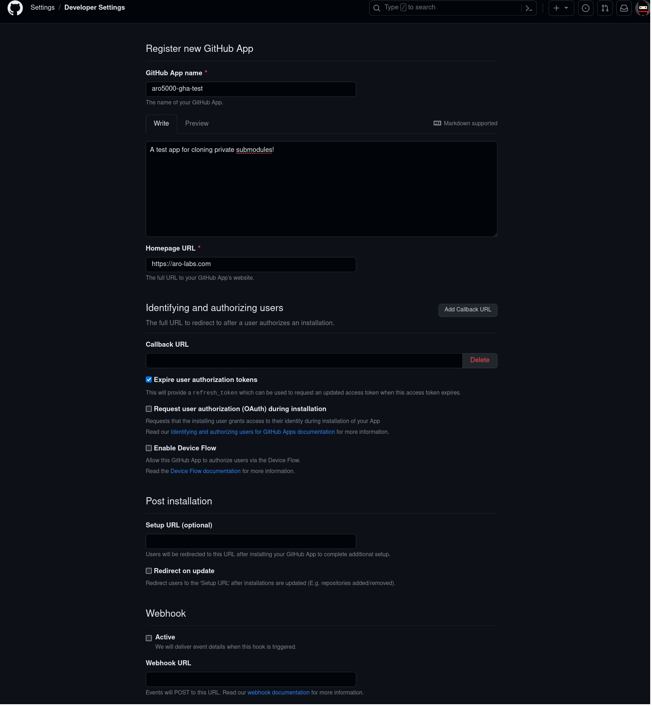
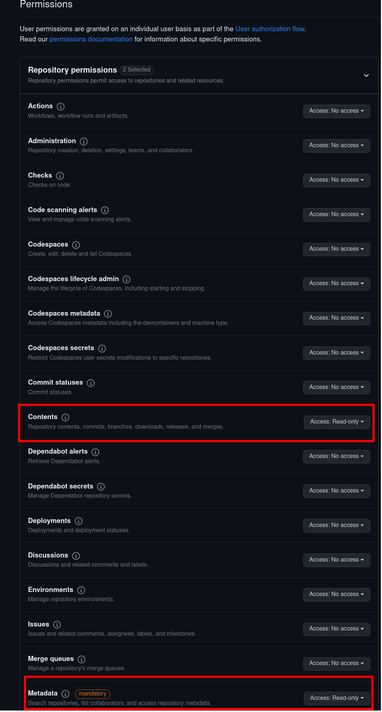
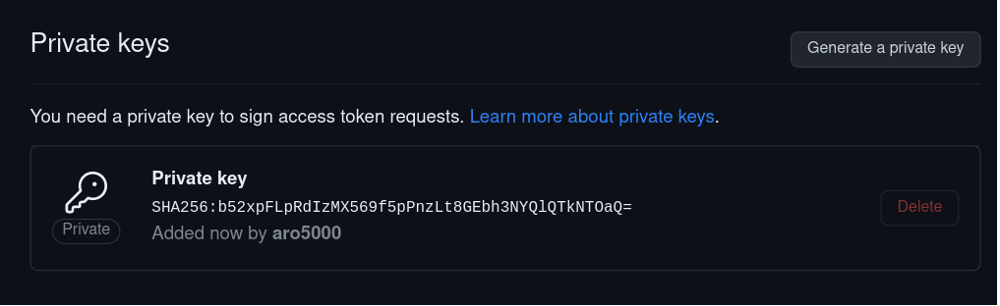
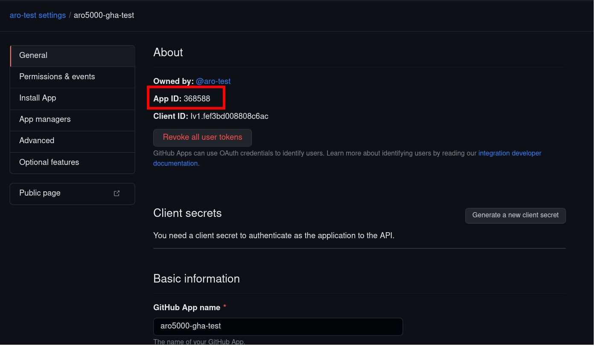
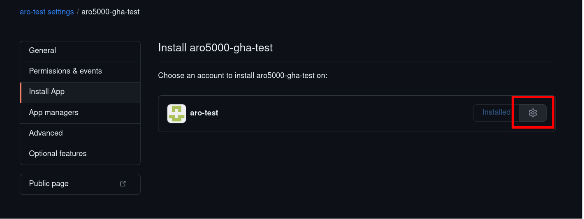
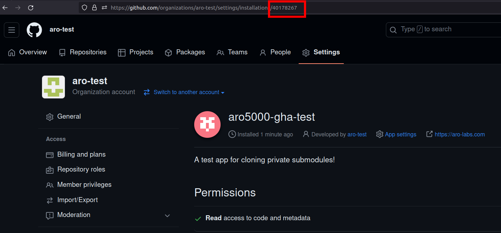

# gha-private-auth

A GitHub action that helps you authenticate as a GitHub app. This authentication allows you to do things like clone private repos from another repo's action (private git submodules).

## Example usage

```yaml
jobs:
  test:
    runs-on: ubuntu-latest
    steps:
      - uses: aro5000/gha-private-auth@v1.0.0
        id: token-generator
        with:
          pem: ${{ secrets.APP_PEM }}
          appId: ${{ secrets.APP_ID }}
          installId: ${{ secrets.APP_INSTALL_ID }}
      - uses: actions/checkout@v3
        with:
          submodules: recursive
          token: ${{ steps.token-generator.outputs.token }}
```

## Create a GitHub App

In order to use this action, you will need to [create a GitHub app](https://docs.github.com/en/apps/creating-github-apps/registering-a-github-app/registering-a-github-app). You can skip most of the install instructions, but ensure you minimally give Read-Only permissions to **Contents** and **Metadata**.



Once you have created the app, you can get the PEM key by scrolling down in the app settings page to the **Private keys** section and click the `Generate a private key` button.


The App ID can be found at the top of the `General` settings page.


The install ID can be found by going to the `Install App` settings page and installing your app. On the installed app page, you will see the Install ID in the URL: `https://github.com/organizations/YOUR-APP-NAME/settings/installations/<INSTALL_ID>`



## Run locally

```
go build
./gha-private-auth "$(cat key.pem)" $APP_ID $INSTALL_ID
```

